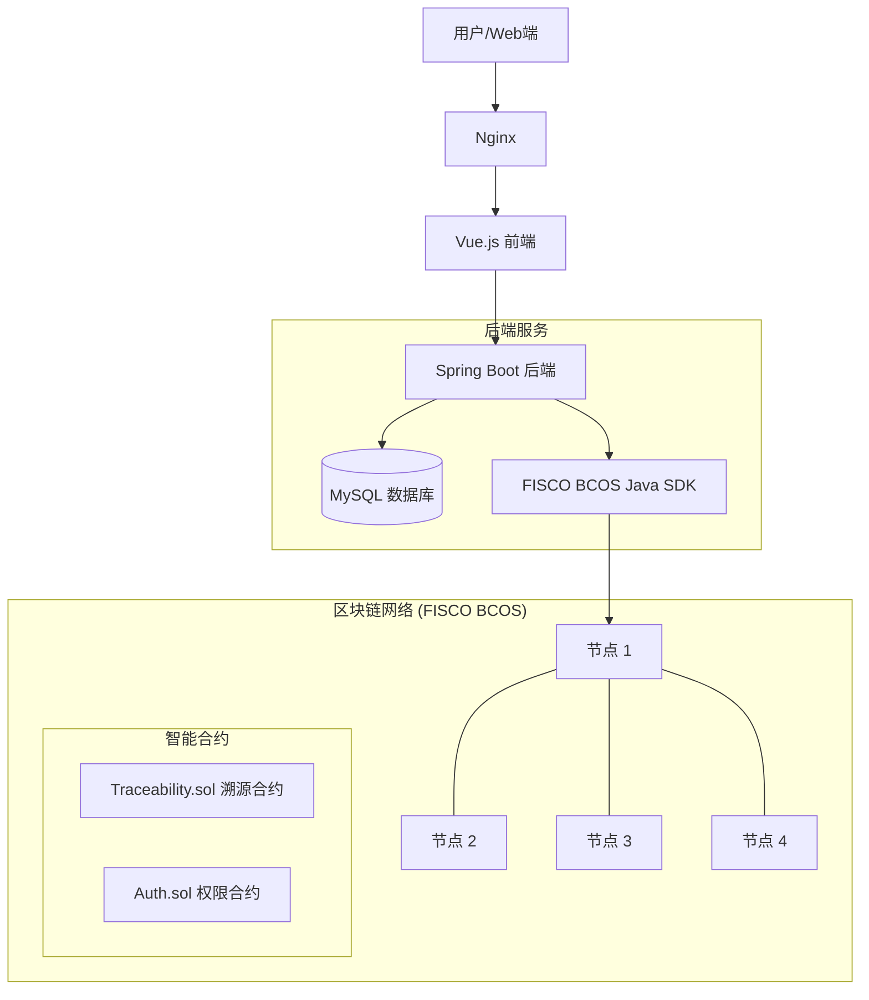

# 基于FISCO BCOS的新能源汽车动力电池全生命周期溯源系统 - 项目实施计划

## 1. 项目概述

本项目旨在利用区块链技术（FISCO BCOS）不可篡改、可追溯的特性，解决新能源汽车动力电池在全生命周期（生产、销售、使用、维修、回收、再利用）中的数据孤岛和信任问题。

## 2. 技术栈选型

### 2.1 区块链层

* **底层平台**: FISCO BCOS 2.x/3.x (推荐 2.8 LTS)
* **控制台**: FISCO BCOS Console
* **智能合约**: Solidity
* **中间件**: WeBASE (可选，用于节点管理，本项目初期建议直接使用 Java SDK 连接)

### 2.2 后端服务层

* **开发语言**: Java 19 (当前环境检测: Java 19.0.2)
* **框架**: Spring Boot 3.2.x (适配 Java 17+)
* **区块链交互**: FISCO BCOS Java SDK 3.x
* **数据库**: MySQL 8.0 (推荐)
* **构建工具**: Maven (本地未检测到全局 Maven，建议使用项目内嵌的 Maven Wrapper)
* **工具**: Lombok, MyBatis-Plus, Hutool

### 2.3 前端应用层

* **运行环境**: Node.js v20.11.1 (当前环境检测)
* **框架**: Vue.js 3.x (Setup 语法糖)
* **构建工具**: Vite
* **UI组件库**: Element Plus
* **图表库**: ECharts (用于数据可视化展示)

## 3. 系统架构设计

系统采用 **前后端分离 + 链上链下协同** 的架构模式。



## 4. 核心功能模块

1. **用户与权限管理模块 (RBAC)**

   * **用户/角色管理**: 支持多角色（厂商、经销商、车主、维修站、回收商）账户创建与管理。
   * **菜单权限控制**: 基于 `sys_menu` 和 `sys_role_menu` 实现动态路由和按钮级权限控制。
   * **数据字典管理**: 维护电池类型、故障等级等静态数据。
2. **电池全生命周期管理模块 (上链核心)**

   * **生产环节**:
     * **生产录入**: 录入电池基础信息 (BMS编码、规格)，关联 `production_batch` (生产批次)。
     * **质检记录**: 记录出厂质检数据 `quality_inspection` (电压、内阻等)，哈希值上链。
   * **销售环节**:
     * **车电绑定**: 在销售时将电池与车辆 `vehicle_info` (VIN码) 进行绑定。
     * **权属转移**: 记录从厂商到经销商，再到车主的权属流转。
   * **使用/维护环节**:
     * **健康监测**: 定期采集 `health_monitor` 数据 (SOH, SOC, 温度)，上报异常。
     * **维修记录**: 维修站录入 `maintenance_record` (故障原因、更换配件)，关键操作上链。
   * **回收环节**:
     * **回收评估**: 录入 `recycling_appraisal` (残值评估、外观检测)，确定处置方案（梯次利用/拆解）。
3. **溯源查询与审计模块**

   * **可视化溯源**: 通过电池ID展示完整的时间轴（生产->销售->使用->维修->回收）。
   * **链上验证**: 提供“一键验真”功能，通过比对数据库中的 TxHash 与链上数据，验证 `chain_transaction` 日志的完整性。
4. **数据可视化大屏**

   * **电池分布地图**: 基于用户归属地的热力图分布。
   * **健康状态统计**: 区域内电池平均 SOH 走势、故障率统计。
   * **回收转化分析**: 梯次利用率与拆解回收率的饼图展示。

## 5. 数据存储方案

为了平衡性能与去中心化，采用“关键数据上链，详细数据下链”的策略。

### 5.1 链上数据 (Smart Contract)

* **BatteryStruct**:
  * `id`: 电池唯一标识
  * `currentOwner`: 当前拥有者
  * `status`: 当前状态 (生产/销售/使用/维修/回收)
  * `traceData`: 溯源记录数组 (包含操作人、操作时间、操作类型、数据哈希)

### 5.2 链下数据 (MySQL)

为了构建一个功能完善、权限分明且业务流程完整的系统，设计了以下 14 张数据库表，涵盖系统管理、电池全生命周期业务、监控预警等模块。

#### A. 系统管理模块 (基础支撑)

1. **`sys_user` (用户表)**: 存储用户账号、密码、联系方式、`dept_id` (归属机构) 等信息。
2. **`sys_role` (角色表)**: 定义系统角色 (如：管理员、生产商、4S店、车主、回收商)。
3. **`sys_menu` (菜单权限表)**: 定义前端侧边栏菜单结构及按钮级别的权限标识。
4. **`sys_user_role` (用户角色关联表)**: 实现用户与角色的多对多关联。
5. **`sys_role_menu` (角色菜单关联表)**: 实现角色与权限的绑定，控制不同角色看到不同页面。
6. **`sys_dict` (数据字典表)**: 统一管理系统中的静态选项 (如：电池类型、故障等级、回收状态码)。
7. **`sys_dept` (机构/部门表)**: **[新增]** 管理参与系统的不同实体企业（如：宁德时代、特斯拉4S店、邦普回收），实现数据隔离和多租户管理。

#### B. 生产与销售模块

8. **`battery_info` (电池主表)**: 电池的“身份证”，存储静态核心数据 (BMS编码、额定容量、标称电压、正极材料类型、生产日期、所属厂商ID)。
9. **`production_batch` (生产批次表)**: 记录电池的生产批次信息，用于批量追溯和质量管控。
10. **`quality_inspection` (出厂质检表)**: 记录电池出厂时的详细检测数据 (OCV、ACR、绝缘电阻、气密性测试结果)。

#### C. 使用与维护模块

11. **`vehicle_info` (车辆信息表)**: 记录新能源汽车信息 (VIN码、车型、品牌)，与电池进行“车电绑定”关联。
12. **`maintenance_record` (维修记录表)**: 记录电池在4S店或维修站的维修详情 (故障现象、处理措施、更换配件、维修时间)。
13. **`health_monitor` (健康监测表)**: 定期采集电池运行数据 (SOC、SOH、循环次数、最高/最低温度)。
14. **`battery_alarm` (故障报警表)**: **[新增]** 记录电池运行过程中的异常报警（如：温度过高、电压异常、SOH过低），用于风险预警。

#### D. 回收与利用模块

15. **`recycling_appraisal` (回收评估表)**: 记录回收时的检测评估数据 (外观检查、残值评估、处置建议：梯次利用/拆解再生)。

#### E. 溯源与审计模块

16. **`battery_transfer_record` (流转记录表)**: **[新增]** 专门记录电池所有权变更（厂家->4S店->车主->回收商）的业务链路，用于快速构建溯源时间轴。
17. **`chain_transaction` (上链日志表)**: 记录每一次业务操作对应的区块链交易哈希 (TxHash)、块高、上链时间，作为“可信证明”的索引表。

## 6. 智能合约设计草案

```solidity
// 简化的合约接口示意
interface IBatteryTrace {
    // 注册电池 (仅生产商)
    function registerBattery(string memory _id, string memory _metaData) external;
  
    // 转移所有权/更新状态 (销售、回收)
    function transfer(string memory _id, address _to, string memory _remark) external;
  
    // 添加维护记录 (维修站)
    function addMaintenanceRecord(string memory _id, string memory _dataHash) external;
  
    // 获取溯源信息
    function getTraceInfo(string memory _id) external view returns (TraceRecord[] memory);
}
```

## 7. 目录结构规划

```
d:\project\bishe\
├── backend/                # Spring Boot 后端项目
│   ├── src/main/java/com/bishe/
│   │   ├── config/         # SDK配置, Swagger配置等
│   │   ├── controller/     # 控制层 (API接口)
│   │   ├── entity/         # 实体类 (数据库表映射)
│   │   ├── mapper/         # 数据访问层 (MyBatis-Plus Mapper接口)
│   │   ├── service/        # 业务逻辑层接口
│   │   │   └── impl/       # 业务逻辑层实现类
│   │   ├── utils/          # 工具类
│   │   └── dto/            # 数据传输对象
│   └── src/main/resources/
│       ├── mapper/         # MyBatis XML 映射文件
│       ├── conf/           # 证书文件
│       └── application.yml
└── frontend/               # Vue.js 前端项目
    ├── public/             # 静态资源 (favicon, logo)
    ├── src/
    │   ├── api/            # API 接口封装 (system, battery, trace)
    │   ├── assets/         # 静态资源 (images, styles, icons)
    │   ├── components/     # 公共组件 (ECharts, Upload, Tables)
    │   ├── hooks/          # 组合式函数 (useDict, usePermission)
    │   ├── layout/         # 布局组件 (Sidebar, Navbar, AppMain)
    │   ├── router/         # 路由配置 & 权限守卫
    │   ├── store/          # 状态管理 (Pinia - user, app, tagsView)
    │   ├── utils/          # 工具类 (request, validate, format)
    │   ├── views/          # 页面视图
    │   │   ├── dashboard/  # 首页仪表盘
    │   │   ├── system/     # 系统管理 (用户, 角色, 部门)
    │   │   ├── battery/    # 电池管理 (录入, 质检, 批次)
    │   │   ├── trace/      # 溯源查询 (时间轴展示)
    │   │   ├── monitor/    # 监控预警 (健康监测, 报警)
    │   │   └── recycling/  # 回收管理 (评估, 处置)
    │   ├── App.vue         # 根组件
    │   └── main.js         # 入口文件
    ├── .env.development    # 开发环境变量
    ├── vite.config.js      # Vite 配置
    └── package.json
```
